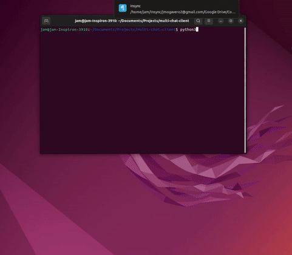

# Multi-Party Chat

# Overview

This is a multi-party client/server based chat. The server runs on one
machine, and many clients can connect to it. The server will also spawn a client
instance so that the person who hosts the server can participate in the chat.

The program leverages the curses library for a better than plain old CLI GUI,
threading, select for I/O multiplexing, multiprocessing, and of course, sockets.

The client will show the current username at the top of the screen and
colorize each unique user name in the chat panel. Input is currently limited
to 120 characters or less per message. 

This program demonstrates a simple proof-of-concept that its possible to leverage sockets and some basic threading/multiprocessing to build a basic AIM-style chat client.




# Running

- THE SERVER MUST BE RUN FIRST! The server.py file automatically starts a client 
  session after the server is running.
- If you get an error starting the server due to a port already in use, you
  can change the PORT variable in both client.py (Line 12) and server.py (Line 
  14)
- This program has been tested with up to 12 clients (including the server 
  client) connected at once and worked flawlessly. This cap can be modified by 
  changing the value of MAX_CONNECTIONS in server.py (Line 17)


```bash
# In two (or more) separate terminals on the same computer from the root of the 
# project directory

# Terminal 1
python3 server.py [-p]

# Terminal 2+
python3 client.py
```

You will be prompted for your name, and then be admitted to the chat.

Note: Without the `-p` switch, the server will operate in "non-persistent" mode
which keeps it within the specification outlined in the project 4 documents.
That is, the server shuts down when the client spawned by the server.py file
receives the '\q' command.

Using the `-p` switch, the server operates in "persistent" mode and will keep
running until the following two conditions are met:

1.  At least one client (including the server user) has connected to the server
2.  All client sockets have disconnected.

> If you get an error at runtime concerning `_curses.init_pair()` run the following command in your terminal and try again `export TERM="xterm-256color"`

## Server.py

The server works by activating a listener socket at startup, and then evaluating
the socket continuously for readability. When it finds the socket is in a
readable state, it will accept the connection creating a new socket with that
client, and then spin off the socket in a new thread, where that client can be
serviced until it disconnects.

The server handles multi-party chat by simply receiving messages from clients,
and echoing the messages back to each client. It maintains a list of connected
clients for this purposes.

The server will shut down when all clients have disconnected under the condition
that at least one client has connected first.


## Client.py

The client starts by asking the user for their name to personalize the
application to the user. The GUI is then loaded presenting the user with an
appropriately sized chat box, with input being at the bottom adjacent to a '>' 
character. The user can type messages up to the length of the line and then
submit by hitting the ENTER key. The user can close the client and disconnect by
typing '\q' at the prompt.


## Terminal.py

The bread and butter of the program. Written using the curses library for 
Python, it transforms a boring CLI into a rich and colorful CLI for the user
to particpate in a chat session. See the code for comments and more details
on the functions contained within.


# Resources if you would like to learn more

I referenced the resources below to create this project. If you are interested in learning more about sockets, threads in Python, curses, or select, check them out!

Python Socket Library:

https://docs.python.org/3/library/socket.html
https://docs.python.org/3/howto/sockets.html

Python Curses Library: 

https://docs.python.org/3/library/curses.html
https://docs.python.org/3/howto/curses.html

Idea for threading off the socket created by accept and broadcasting the messages
back to the hosts:

https://hackernoon.com/creating-command-line-based-chat-room-using-python-oxu3u33

Python Threading Library:
https://docs.python.org/3/library/threading.html

Getting the Color Codes for the Terminal:
https://www.unixtutorial.org/how-to-show-colour-numbers-in-unix-terminal/

Python Select Library (for I/O Multiplexing):
https://docs.python.org/3/library/select.html
